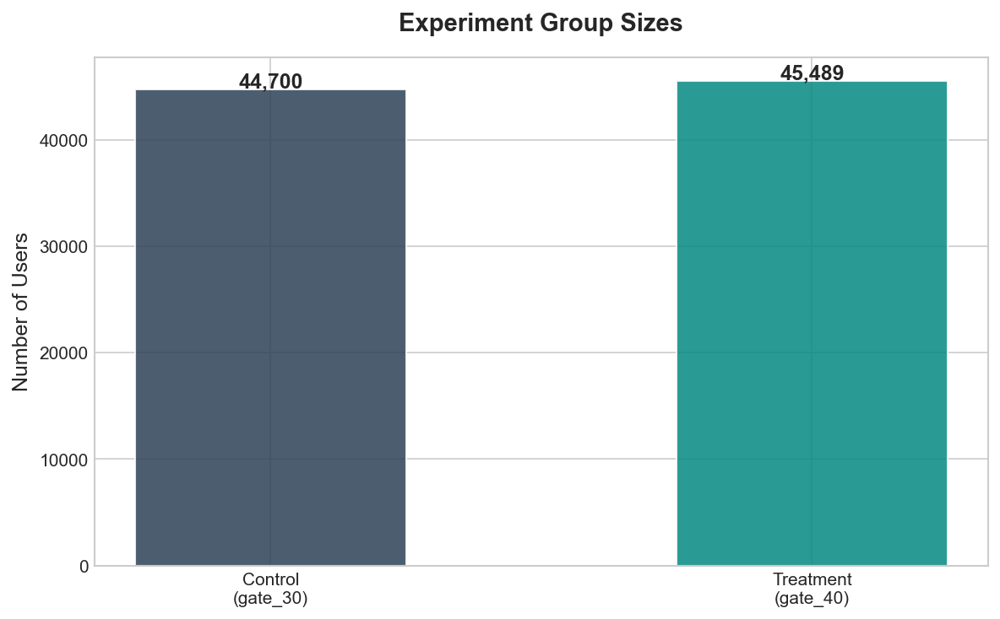
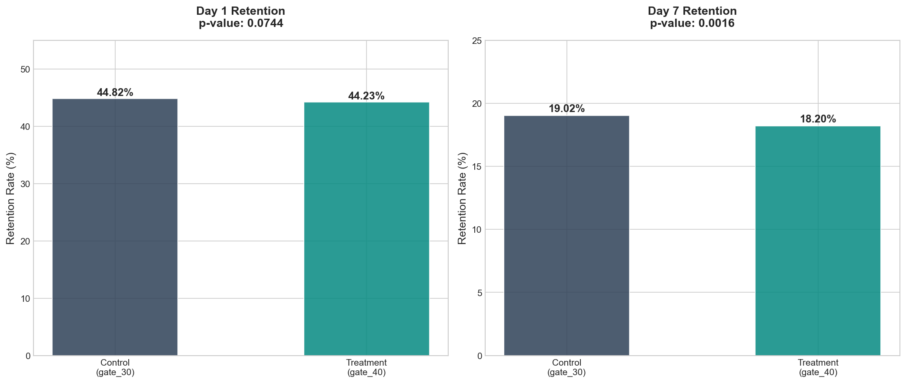
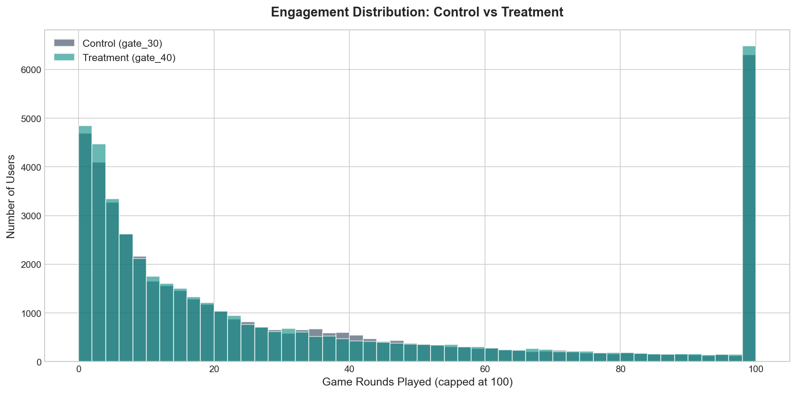
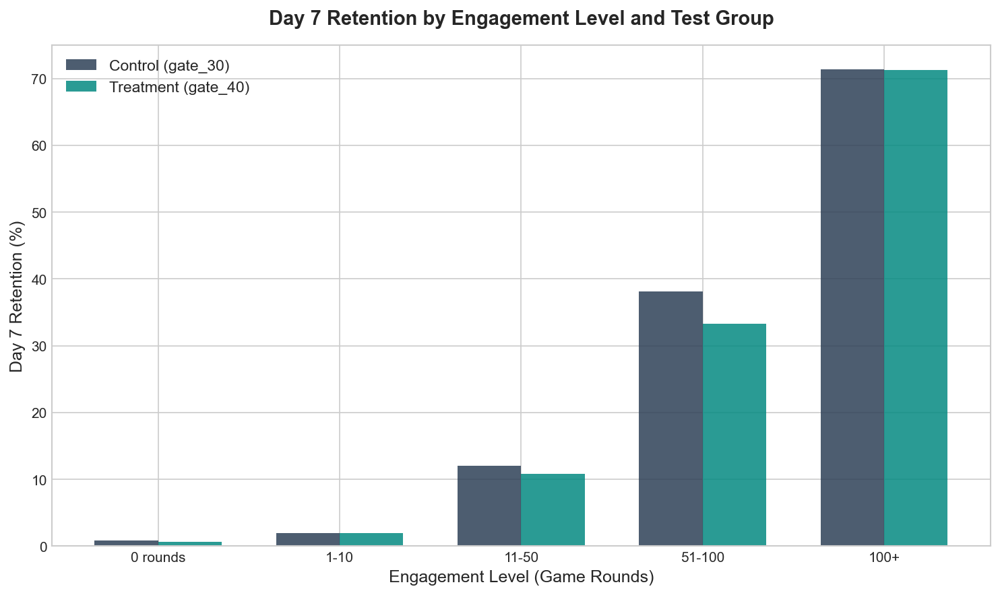
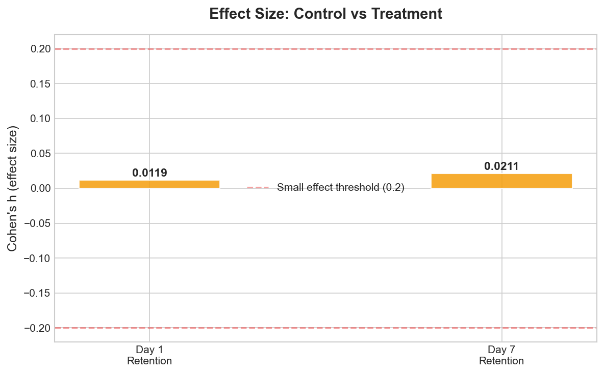

# A/B Test Analysis: Product Retention Experiment

A statistical analysis of a real A/B test with 90,189 users, evaluating whether a product change (moving a feature gate from level 30 to level 40) improves user retention. Covers experiment design validation, hypothesis testing, confidence intervals, effect size, and segmented analysis.

## Dataset

Cookie Cats A/B testing dataset (90,189 users). A real experiment from a mobile game testing whether changing when users hit a progression gate affects Day 1 and Day 7 retention. Source: https://www.kaggle.com/datasets/yufengsui/mobile-games-ab-testing

## Why This Analysis Matters for Product Teams

This is the kind of experiment a product team at any subscription company would run: 'We changed something in the product. Did it improve retention?' The framework applies directly to questions like:
- Did the new onboarding flow improve 7-day retention?
- Does showing a feature earlier increase adoption?
- Should we ship this change or revert it?

## Analysis Sections

### 1. Experiment Validation
Checks that control and treatment groups are balanced (roughly 50/50 split) and data quality is clean. An unbalanced experiment produces unreliable results.

### 2. Retention Comparison (D1 and D7)
Compares Day 1 and Day 7 retention between control and treatment groups. Includes two-proportion z-tests, p-values, and 95% confidence intervals.

### 3. Engagement Distribution
Compares how many game rounds users played across control and treatment groups using histograms and a Mann-Whitney U test (non-parametric, appropriate for skewed data).

### 4. Retention by Engagement Level
Segments users by engagement (0 rounds, 1-10, 11-50, 51-100, 100+) and compares retention within each segment. This reveals whether the treatment helps some users while hurting others.

### 5. Effect Size
Calculates Cohen's h to measure practical significance beyond statistical significance. A statistically significant result with a negligible effect size may not justify a product change.

## Statistical Methods Used

- Two-proportion z-test for comparing retention rates
- 95% confidence intervals for the difference in proportions
- Mann-Whitney U test for comparing engagement distributions (non-parametric)
- Cohen's h for effect size measurement
- Segmented analysis to identify differential effects

## Key Concepts Demonstrated

- Hypothesis formulation (null: no difference, alternative: gate position affects retention)
- Sample size validation and group balance checking
- Statistical significance vs practical significance (p-values are not enough)
- Confidence intervals (range of plausible effect sizes)
- Segmented analysis (overall effects can hide segment-level differences)
- Clear recommendation tied to evidence

## Tech Stack

- Python (Pandas, NumPy, SciPy, Matplotlib)
- Real experiment data (90,189 users)

## How to Run

    pip3 install pandas matplotlib numpy scipy
    python3 analyze.py

Charts are saved to the /charts directory.

## Connection to Other Projects

This project complements my dbt + Snowflake project (data infrastructure) and Python churn analysis (product analytics). Together they demonstrate the full data workflow: build trusted data foundations, analyze patterns, and evaluate experiments to inform product decisions.
